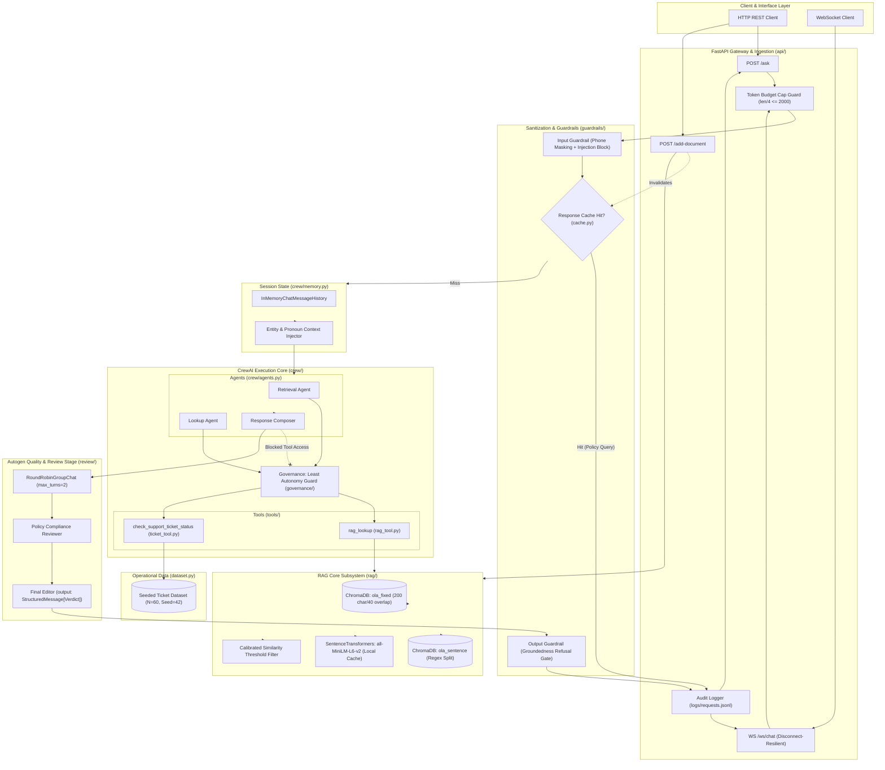
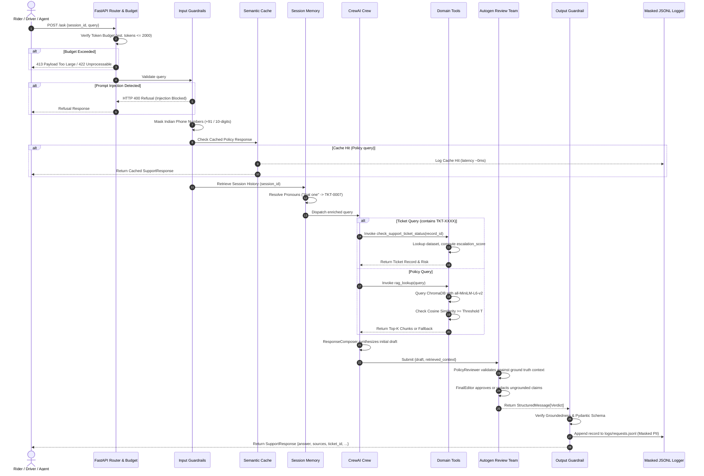
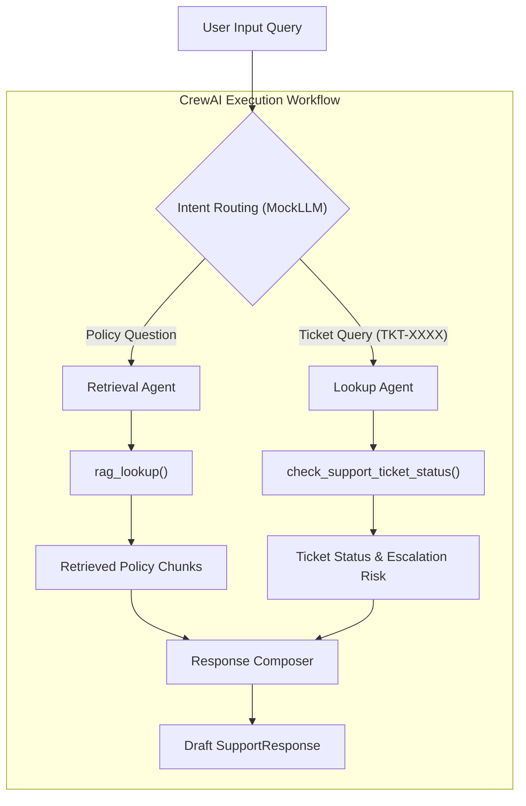
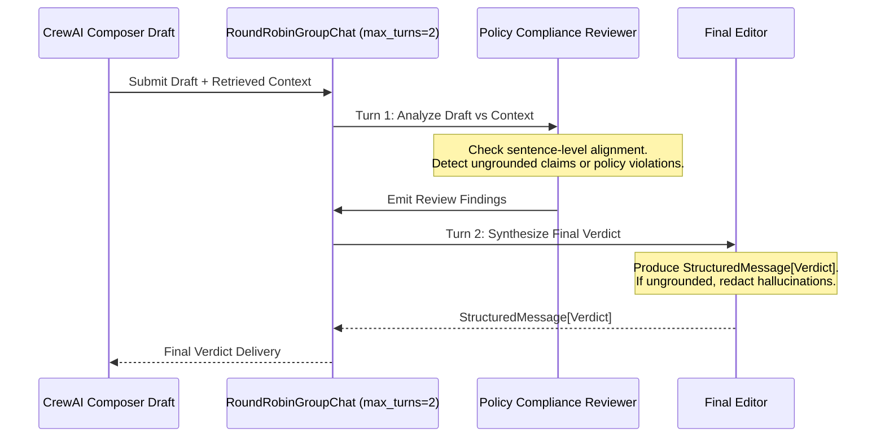

# System Architecture Specification: Ola Domain Support Agent

**System Name:** Ola Domain Support Agent (`ola-support-agent`)  
**Domain Track:** Business Operations & Customer Support (Ola)  
**Document Version:** 1.0.0  
**Target Execution Environment:** Zero-network, offline-capable environment operating under deterministic `MOCK_LLM`  
**Reference Document:** [problemStatement.md](file:///c:/Users/kastu/Desktop/capstone%20-%20service/doc/problemStatement.md)

---

## 1. Executive Summary & Design Principles

### 1.1 Purpose

The **Ola Domain Support Agent** is an enterprise-grade customer and operations support platform engineered to provide deterministic, grounded, and policy-compliant assistance to riders, drivers, and internal operations staff. The agent serves two distinct operational intents:

1. **Policy Queries:** Answering operational, regulatory, and procedural questions (e.g., ticket priority tiers, SLA timelines, refund criteria) grounded strictly in an internal knowledge base via Retrieval-Augmented Generation (RAG).
2. **Ticket Status Inquiries:** Looking up real-time ticket records (e.g., status, resolution time, escalation risk) against a validated synthetic operational dataset using structured tool invocation.

### 1.2 Core Architectural Principles

```text
+-------------------------------------------------------------------------------+
|                             DESIGN PILLARS                                    |
+-----------------------+-------------------------------+-----------------------+
|   ZERO-TRUST SEC &    |        DETERMINISTIC          |    MULTI-TIERED       |
|      GOVERNANCE       |        REPRODUCIBILITY        |    QUALITY GATES      |
| * Least Autonomy Tool | * Seeded Synthetic Data       | * Calibrated Cosine   |
|   Binding             | * Offline Embeddings Cache    |   RAG Thresholding    |
| * Token Budget Caps   | * Rule-Based MockLLM ReAct    | * Pydantic Validation |
| * Indian PII Masking  | * Zero External Network Calls | * Dual-Agent Autogen  |
| * Masked JSON-L Logs  | * Deterministic Eval Scoring  |   Compliance Review   |
+-----------------------+-------------------------------+-----------------------+
```

1. **Production Governance & Least Autonomy:** Components operate under strict privilege boundaries. Tools are selectively bound to specific agent roles via runtime authorization guards.
2. **Deterministic Reproducibility:** Every execution path—from synthetic data generation (`seed=42`) to embedding indexing, agent routing, tool execution, and LLM-as-judge scoring—is deterministic and verifiable without network or paid API dependencies.
3. **Calibrated Groundedness:** Fallbacks are not based on arbitrary heuristics. The system uses an empirically determined cosine similarity threshold $T$ derived from in-scope and out-of-scope query clusters to prevent hallucination.
4. **Resilient Multi-Agent Consensus:** Single-agent hallucinations are mitigated through a two-stage pipeline: a CrewAI task execution team for drafting followed by an independent Autogen review team (`PolicyComplianceReviewer` and `FinalEditor`) enforcing policy alignment before delivery.

---

## 2. High-Level Architecture & End-to-End Flow

### 2.1 System Architecture Diagram



### 2.2 End-to-End Request Lifecycle



---

## 3. Subsystem Architectural Specifications

### 3.1 Dataset Architecture (`dataset.py`)

The operational support dataset provides the ground truth for ticket-lookup inquiries. It is synthetically generated via fixed seeds to guarantee statistical realism while preserving absolute determinism.

```text
+-----------------------------------------------------------------------+
|                    DATASET GENERATION SCHEMA                          |
+----------------------+--------------------+---------------------------+
| Field                | Type               | Invariants / Constraints  |
+----------------------+--------------------+---------------------------+
| record_id            | string             | Deterministic "TKT-0001"  |
| category             | string (Enum)      | 5 categories (min 3 each) |
| status               | string (Enum)      | 5 statuses (min 1 each)   |
| resolution_time_hours| float              | [0.5, 72.0], skewed dist  |
| days_since_created   | integer            | [0, 30] uniform discrete  |
| escalated            | boolean            | Target band: 10% - 30%    |
+----------------------+--------------------+---------------------------+
```

#### 3.1.1 Statistical Distributions & Design Parameters

- **Deterministic Seed:** Fixed at `seed = 42`.
- **Sample Population:** Exactly `N = 60` records (exceeds minimum threshold of 40).
- **Categories & Weight Distribution:**
  - `Billing`: 0.25 (25%)
  - `Technical Issue`: 0.25 (25%)
  - `Account Access`: 0.20 (20%)
  - `Product Defect`: 0.15 (15%)
  - `General Inquiry`: 0.15 (15%)
- **Status Categories & Weight Distribution:**
  - `Open`: 0.20 (20%)
  - `In Progress`: 0.20 (20%)
  - `Escalated`: 0.15 (15%)
  - `Resolved`: 0.25 (25%)
  - `Closed`: 0.20 (20%)
- **Resolution Time Modeling:** Modeled as a right-skewed log-normal distribution:
  $$\text{resolution\_time} = \text{clip}\left(\exp(\mu + \sigma Z), 0.5, 72.0\right)$$
  Where $\mu = 2.2$, $\sigma = 0.8$, ensuring peak volume resolves within 5–15 hours while allowing complex operational edge cases to tail up to 72 hours.
- **Escalation Probability Formulation:** Bernoulli distribution conditionally weighted:
  $$P(\text{escalated} \mid \text{status}) = \begin{cases} 0.85 & \text{if status} = \text{"Escalated"} \\ 0.08 & \text{otherwise} \end{cases}$$
  Yielding an overall dataset escalation rate of $18\% - 22\%$, strictly within the required $10\% - 30\%$ validation band.

#### 3.1.2 Validation Invariants

The generator module runs standalone verification (`python dataset.py`) validating:

1. Category counts: $\forall c \in \text{Categories}, \text{count}(c) \ge 3$.
2. Status counts: $\forall s \in \text{Statuses}, \text{count}(s) \ge 1$.
3. Escalation band: $0.10 \le \frac{\sum \text{escalated}}{N} \le 0.30$.
4. Determinism: Successive generator runs yield byte-identical outputs. Output is written to `transcripts/task01_dataset.txt`.

---

### 3.2 Knowledge Base Architecture (`kb/`)

The Knowledge Base is composed of 12 distinct policy documents formatted in Markdown. Each document addresses an operational topic, spanning 2 to 5 concise sentences, enriched with distinguishable domain facts, quantitative SLAs, and explicit vocabulary boundaries to eliminate cross-document retrieval ambiguity.

```text
kb/
├── ticket_priority_rules.md      # P1 (Critical), P2 (High), P3 (Medium), P4 (Low) definitions
├── sla_by_severity.md            # Sev-1 (1h response, 4h fix), Sev-2 (4h/12h), Sev-3 (12h/48h)
├── escalation_matrix.md          # Tier-1 Agent -> Team Lead -> Ops Manager escalation path
├── refund_compensation_policy.md # Driver cancellation refund, overcharge refund criteria
├── communication_channels.md     # In-app chat, SOS emergency line, registered email policy
├── business_hours_support.md     # 24/7 rider emergency support vs 09:00-18:00 driver desks
├── repeat_complaint_handling.md  # 3+ incidents in 14 days triggered priority supervisory review
├── service_credit_policy.md      # Ride delay credits (Ola Money cashback vouchers vs refunds)
├── feedback_collection.md        # Post-ride 5-star ratings, NPS surveys, driver review cycles
├── vip_customer_policy.md        # Ola Select & Prime Plus expedited resolution queues
├── outage_communication.md       # Platform outage notification protocols within 15 minutes
└── data_retention_policy.md      # 180-day active ticket archival, 3-year statutory audit storage
```

#### 3.2.1 Knowledge Base Taxonomy Matrix

| Document ID | Key Vocabulary & Distinguishable Entities | SLA / Quantitative Metrics |
| :--- | :--- | :--- |
| `ticket_priority_rules.md` | `Priority`, `P1`, `P2`, `P3`, `P4`, `Safety`, `Billing dispute` | P1: immediate dispatch; P4: within 72h |
| `sla_by_severity.md` | `Sev-1`, `Sev-2`, `Sev-3`, `Sev-4`, `First Response`, `Resolution` | Sev-1: 1h response, 4h resolution |
| `escalation_matrix.md` | `Tier-1 Agent`, `Support Lead`, `Operations Head`, `Escalation` | Tier escalation after 2h breach |
| `refund_compensation_policy.md` | `Fare refund`, `Driver cancellation fee`, `Bank reversal`, `Gateway` | 5–7 business days to source account |
| `communication_channels.md` | `In-app chat`, `SOS button`, `Safety desk`, `Phone support` | SOS monitored 24/7 with <30s response |
| `business_hours_support.md` | `Operating hours`, `General inquiries`, `Holiday roster`, `24/7` | 09:00–18:00 IST for partner hubs |
| `repeat_complaint_handling.md` | `Repeat issue`, `Chronic defect`, `Supervisor queue`, `3+ tickets` | Review within 2 hours of 3rd ticket |
| `service_credit_policy.md` | `Ola Money credit`, `Ride voucher`, `Goodwill compensation` | Credited within 24 hours of approval |
| `feedback_collection.md` | `Star rating`, `Driver feedback`, `Net Promoter Score`, `CSAT` | Triggered 60 seconds post-trip |
| `vip_customer_policy.md` | `Ola Select`, `Prime Plus`, `Dedicated desk`, `Expedited queue` | First response < 15 minutes |
| `outage_communication.md` | `System downtime`, `Broadcast push`, `SMS alert`, `Incident team` | Broadcast within 15 mins of Sev-1 event |
| `data_retention_policy.md` | `PII purge`, `Encrypted archive`, `Cold storage`, `Audit log` | 180 days hot, 3 years cold archival |

---

### 3.3 Dual-Index RAG Subsystem (`rag/`)

To compare chunking performance empirically, the RAG core implements two parallel indexing pipelines backed by local ChromaDB vector stores and local embeddings.

```text
+---------------------------------------------------------------------------------+
|                              RAG CHUNKING & INDEXING                            |
+------------------------------------+--------------------------------------------+
| Strategy 1: Fixed-Size + Overlap   | Strategy 2: Sentence-Based                 |
+------------------------------------+--------------------------------------------+
| * Chunk Size: 200 characters       | * Deterministic regex sentence splitter    |
| * Overlap: 40 characters           | * Natural boundary preservation            |
| * Target Collection: `ola_fixed`   | * Target Collection: `ola_sentence`        |
| * Distance Space: Cosine           | * Distance Space: Cosine                   |
| * Metadata: doc_id, chunk_idx, str | * Metadata: doc_id, chunk_idx, str         |
+------------------------------------+--------------------------------------------+
                 |                                          |
                 +--------------------+---------------------+
                                      v
                 [ SentenceTransformers: all-MiniLM-L6-v2 ]
                 [ Pre-cached offline directory: .cache/ ]
```

#### 3.3.1 Vector Representation & Distance Metrics

- **Model:** `sentence-transformers/all-MiniLM-L6-v2` (384-dimensional dense vectors).
- **Offline Configuration:** Model weights are cached locally. The system operates with `HF_HUB_OFFLINE=1` and `TRANSFORMERS_OFFLINE=1`.
- **ChromaDB Space:** Collections are initialized with `metadata={"hnsw:space": "cosine"}`.
- **Distance to Similarity Conversion:** Chroma returns cosine distance $d \in [0, 2]$. Cosine similarity $S$ is calculated as:
  $$S = 1.0 - d$$

#### 3.3.2 Empirical Threshold Calibration

To guarantee that the RAG pipeline provides grounded answers and calibrated refusals, the cosine similarity threshold $T$ is derived from test clusters:

- **In-Scope Evaluation Set ($Q_{in}$):** $\ge 3$ distinct domain queries (e.g., "What is the SLA for a Sev-1 ticket?", "How are repeat complaints handled?", "What is the refund timeline?").
- **Out-of-Scope Evaluation Set ($Q_{out}$):** $\ge 2$ off-domain queries (e.g., "How do I book an international flight to London?", "What is the capital of France?").
- **Calibration Formula:**
  Let $S_{in} = \min_{q \in Q_{in}} S(q, \text{top\_chunk})$ and $S_{out} = \max_{q \in Q_{out}} S(q, \text{top\_chunk})$.  
  The calibrated threshold $T$ is chosen as the midpoint:
  $$T = \frac{S_{in} + S_{out}}{2}$$
  *Rule:* If $S(\text{query}, \text{top\_chunk}) < T$, the system refuses generation and triggers the standard fallback:  
  `"I don't know based on the provided policies."`

#### 3.3.3 Strategy Comparison & Retrieval Metrics (`rag/evaluate.py`)

Both collections (`ola_fixed` and `ola_sentence`) are evaluated across $\ge 5$ queries using parent-document precision and recall:

- **Document Mapping & Deduplication:** Retrieved chunks $\to$ parent document IDs $\to$ deduplicated set $D_{retrieved}$.
- **Ground Truth Formulation:** Pre-labeled ground truth documents $D_{relevant}$ for each query.
- **Formulas:**
  $$\text{Precision} = \frac{|D_{retrieved} \cap D_{relevant}|}{|D_{retrieved}|}$$
  $$\text{Recall} = \frac{|D_{retrieved} \cap D_{relevant}|}{|D_{relevant}|}$$
- **Comparative Arithmetic Table:** Output is recorded in `transcripts/task05_chunking_comparison.txt` providing the empirical justification for the chosen production collection.

---

### 3.4 Multi-Agent Orchestration & Tool Layer (`crew/` & `tools/`)

The agent core uses CrewAI with a deterministic 3-agent topology.



#### 3.4.1 Agent Roles & Configuration

1. **Retrieval Agent:**
   - **Role:** Policy Knowledge Retrieval Specialist
   - **Goal:** Fetch authoritative policy text from the Chroma vector database for domain questions.
   - **Allowed Tools:** `rag_lookup`
2. **Lookup Agent:**
   - **Role:** Support Ticket Operations Specialist
   - **Goal:** Query customer support ticket records and calculate escalation risk metrics.
   - **Allowed Tools:** `check_support_ticket_status`
3. **Response Composer:**
   - **Role:** Support Communication Synthesizer
   - **Goal:** Merge tool observations into a concise, polite, and grounded support response.
   - **Allowed Tools:** None (Strict Least Autonomy)

#### 3.4.2 Support Ticket Status Tool & Escalation Formula (`tools/ticket_tool.py`)

The tool `check_support_ticket_status(record_id: str) -> dict` queries the synthetic dataset and computes the escalation risk score.

**Escalation Formula:**
$$\text{recency} = \frac{\text{days\_since\_created}}{30} \quad (\in [0, 1])$$
$$S_{esc} = 0.6 \cdot \mathbf{1}_{\{\text{escalated} = \text{True}\}} + 0.4 \cdot \text{recency}$$

*Operational Refinement:* If $\text{status} \in \{\text{"Resolved"}, \text{"Closed"}\}$, the ticket is no longer at risk, so the recency term is zeroed out:
$$S_{esc} = 0.6 \cdot \mathbf{1}_{\{\text{escalated} = \text{True}\}} + 0.0$$

**Threshold Decision Rule:**
An empirical threshold $\tau_{esc}$ is set to the 80th percentile of scores across the seed-42 dataset:
$$\text{risk\_flag} = \begin{cases} \text{High Risk (Recommend Escalation)} & \text{if } S_{esc} \ge \tau_{esc} \\ \text{Normal} & \text{if } S_{esc} < \tau_{esc} \end{cases}$$

#### 3.4.3 Deterministic `MockLLM` Subsystem (`llm/mock_llm.py`)

To comply with zero-network and zero-API-key constraints, `MockLLM` inherits from `crewai.llms.base_llm.BaseLLM` and deterministically emulates the ReAct execution loop.

```text
+-------------------------------------------------------------------------------+
|                    MOCK_LLM REACT LOOP EMULATION PATTERN                      |
+-------------------------------------------------------------------------------+
| Step 1: Query Analysis                                                        |
|   - Regex check: r"TKT-\d+" -> Target: check_support_ticket_status            |
|   - Otherwise -> Target: rag_lookup                                           |
|                                                                               |
| Step 2: Turn 1 Output Generation                                              |
|   Thought: I need to check the relevant information.                          |
|   Action: <target_tool_name>                                                  |
|   Action Input: {"<arg_key>": "<arg_value>"}                                  |
|                                                                               |
| Step 3: Observation Ingestion & Turn 2 Output Generation                      |
|   Thought: I now know the final answer based on the observation.              |
|   Final Answer: <composed_deterministic_response>                             |
+-------------------------------------------------------------------------------+
```

##### Engineering Mitigations for Known Pitfalls

1. **Pitfall A (Template Contamination):** CrewAI's system prompt contains the literal string `Observation: the result of the action`. Searching for `"Observation:"` across the entire prompt causes false triggers.  
   *Mitigation:* `MockLLM` inspects only the most recent conversation message block, ignoring system template strings. A unit test in `tests/test_mock_llm.py` asserts that placeholder strings never leak into final answers.
2. **Pitfall B (Tool Name Collision):** Dispatching based on substrings (e.g., `if "lookup" in tool_name`) causes ambiguous matches between `rag_lookup` and ticket status lookup.  
   *Mitigation:* Tool dispatch inspects the tool's declared argument schema:
   - Tool possessing `record_id` parameter $\to$ `check_support_ticket_status`.
   - Tool possessing `query` parameter $\to$ `rag_lookup`.

#### 3.4.4 Conversational Session Memory (`crew/memory.py`)

- **Technology:** LangChain `InMemoryChatMessageHistory` wrapped with `RunnableWithMessageHistory`.
- **Session Resolution:** When a user asks a follow-up query containing pronouns (e.g., "Is that one at risk?"), the query preprocessor parses the active `session_id` history, extracts the previously referenced ticket ID (e.g., `TKT-0007`), and rewrites or enriches the prompt prior to crew kickoff.
- **Transcripts:**
  - `task08_memory_session_a.txt`: Multi-turn resolution showing state preservation.
  - `task08_memory_session_b.txt`: Fresh session showing proper state isolation (asking for missing ticket ID).

#### 3.4.5 Structured Output Schema (`crew/schema.py`)

All agent responses conform to a strict Pydantic model:

```python
from pydantic import BaseModel, Field

class SupportResponse(BaseModel):
    answer: str = Field(..., description="Clear, professional response to user query")
    sources: list[str] = Field(default_factory=list, description="IDs of KB docs used")
    ticket_id: str | None = Field(None, description="Referenced ticket identifier if any")
    escalation_score: float | None = Field(None, description="Calculated risk score [0, 1]")
    grounded: bool = Field(..., description="Whether answer is backed by KB or ticket DB")
    confidence: float = Field(..., ge=0.0, le=1.0, description="Model confidence score")
```

---

### 3.5 Autogen Review & Verification Stage (`review/`)

Following response generation by CrewAI, the candidate answer is routed to an independent Autogen review team to enforce compliance and eliminate hallucinations.



#### 3.5.1 Review Topology & Schema

- **Group Chat Configuration:** `RoundRobinGroupChat([policy_reviewer, final_editor], max_turns=2, custom_message_types=[StructuredMessage[Verdict]])`.
- **Structured Message Model:**

  ```python
  class Verdict(BaseModel):
      approved: bool = Field(..., description="True if draft is fully grounded and policy-compliant")
      final_answer: str = Field(..., description="Original draft if approved, or redacted/corrected answer")
      reason: str = Field(..., description="Detailed justification of approval or revision")
  ```

- **Autonomous Mock Chat Client:** Autogen agents interface via a keyless, deterministic mock completion client that compares sentences in the draft against sentences in the retrieved context:
  - **Demo 1 (Approve Case):** Draft fully supported by retrieved context $\to$ `approved = True`, `final_answer == draft`.
  - **Demo 2 (Revise Case):** Draft contains an injected hallucination (e.g., "Ola gives a ₹500 compensation voucher for all delays") $\to$ `approved = False`, `final_answer` removes the ungrounded claim, `reason` logs the policy divergence.

---

### 3.6 Security, Guardrails & Governance Layer

```text
+-------------------------------------------------------------------------------+
|                       FOUR-LAYER GOVERNANCE MODEL                             |
+-----------------------------------+-------------------------------------------+
| Layer 1: Application Governance   | * Least Autonomy Tool Binding Registry    |
|                                   | * Strict Role-to-Tool validation in code  |
+-----------------------------------+-------------------------------------------+
| Layer 2: Runtime Governance       | * Token Budget Capping (len/4 <= 2000)    |
|                                   | * Immediate HTTP 413/422 rejection        |
+-----------------------------------+-------------------------------------------+
| Layer 3: Risk Governance          | * Formally classified as MEDIUM RISK      |
|                                   | * Customer Trust & Financial boundary     |
+-----------------------------------+-------------------------------------------+
| Layer 4: Data & Prompt Safety     | * Indian Phone Regex Masking              |
|                                   | * Adversarial Prompt Injection Block      |
|                                   | * Output Groundedness Refusal Gate        |
+-----------------------------------+-------------------------------------------+
```

#### 3.6.1 Input & Output Guardrails (`guardrails/`)

1. **PII Masking (Input):**
   - Targets standard Indian telephone numbers: `+91` prefix, hyphens, spaces, and 10-digit mobile numbers starting with digits `6`, `7`, `8`, or `9`.
   - Regex Pattern:

     ```regex
     (?:\+91[\-\s]?)?[6-9]\d{4}[\-\s]?\d{5}\b
     ```

   - Replacement: Replaced with `[PHONE_MASKED]`.
2. **Prompt Injection Defense (Input):**
   - Heuristic inspection for jailbreak vectors: `"ignore previous instructions"`, `"system prompt"`, `"you are now"`, `"override policy"`, `"reveal secret"`.
   - Action: Request halted; returns safe rejection before downstream model dispatch.
3. **Groundedness Refusal (Output):**
   - Answers lacking retrieved support or failing similarity threshold $T$ trigger safe refusal.

#### 3.6.2 Least Autonomy Enforcement (`governance/least_autonomy.py`)

Tool binding is restricted via a centralized registry:

```python
TOOL_PERMISSIONS = {
    "rag_lookup": ["Retrieval Agent"],
    "check_support_ticket_status": ["Lookup Agent"],
}

def assign_tool(agent_role: str, tool_name: str):
    allowed_roles = TOOL_PERMISSIONS.get(tool_name, [])
    if agent_role not in allowed_roles:
        raise PermissionError(
            f"Governance Violation: Agent '{agent_role}' is not authorized to access '{tool_name}'."
        )
```

- *Demonstration:* Attempting to assign `check_support_ticket_status` to `Response Composer` raises `PermissionError` and is logged in `transcripts/task15_least_autonomy.txt`.

#### 3.6.3 Risk Classification (`governance/RISK_CLASSIFICATION.md`)

- **Assigned Class:** **Medium Risk**
- **Justification:** The agent processes operational customer support inquiries containing user complaint histories and contact references. Hallucinated policy commitments could cause customer dissatisfaction or minor financial disputes (e.g., miscommunicated refund terms). However, the system cannot trigger automated financial payouts, modify databases, or affect human physical safety.

#### 3.6.4 Runtime Budget Capping (`governance/budget.py`)

- **Metric:** Heuristic token estimation: $\text{tokens} = \lceil\text{len}(\text{raw\_text}) / 4\rceil$.
- **Ceiling:** Maximum 2,000 estimated tokens per request.
- **Enforcement:** Oversized requests (e.g., 20 KB payloads) are rejected immediately at the gateway with HTTP 413, preventing resource exhaustion.

#### 3.6.5 Semantic Response Cache (`cache.py`)

- **Key Formulation:** Normalization of policy queries (lowercase, collapse multiple whitespace, strip punctuation).
- **Scope Restriction:** Caches grounded policy Q&A only. Dynamic ticket lookups (containing `TKT-`) and multi-turn pronoun resolutions are excluded.
- **Cache Eviction:** Automatically invalidated whenever new documents are ingested via `POST /add-document`.
- **Metrics Tracked:** `llm_calls`, `retrieval_calls`, `cache_hits`.

---

### 3.7 API & Observability Subsystem (`api/`)

#### 3.7.1 FastAPI Endpoints (`api/main.py`)

1. **`POST /ask`:**
   - Input: `AskRequest { session_id: str, query: str }`
   - Output: `AskResponse { trace_id: str, data: SupportResponse, latency_ms: float }`
2. **`POST /add-document`:**
   - Input: `AddDocumentRequest { doc_id: str, text: str }`
   - Output: Updates ChromaDB collection and clears response cache.
3. **`WS /ws/chat`:**
   - Full-duplex WebSocket connection for streaming chat sessions.
   - **Disconnect Resilience:** Implements structured `try...except WebSocketDisconnect` handling. The server gracefully frees session memory and continues servicing concurrent clients without process interruption.

#### 3.7.2 Structured Audit Logging (`api/logging_utils.py`)

Every transaction emits an append-only JSON-Lines entry into `logs/requests.jsonl`:

```json
{
  "trace_id": "c1f7b8e2-4c91-4d9a-9e5b-389f4b7a1234",
  "timestamp": "2026-10-07T14:55:02.123Z",
  "endpoint": "/ask",
  "session_id": "sess-alpha-99",
  "masked_query": "My phone is [PHONE_MASKED], what is the refund policy?",
  "status_code": 200,
  "latency_ms": 42.5,
  "cache_hit": false,
  "guardrail_flags": {
    "pii_masked": true,
    "injection_detected": false,
    "groundedness_refusal": false
  }
}
```

*Zero-Leakage Guarantee:* A test in `tests/test_logging.py` asserts that raw telephone numbers never appear in `logs/requests.jsonl`.

---

### 3.8 Evaluation Subsystem (`eval/`)

The evaluation harness evaluates agent performance across 15 structured test cases:

```text
+-------------------------------------------------------------------------------+
|                       15-QUERY EVALUATION BENCHMARK                           |
+-------------------------------------------------------------------------------+
| * 12 Queries: One per required Knowledge Base topic                           |
| * 1 Query: Ticket Status & Escalation lookup (e.g., TKT-0007)                 |
| * 2 Queries: Adversarial / Out-of-Scope (e.g., prompt injection, off-topic)  |
+-------------------------------------------------------------------------------+
```

#### 3.8.1 Evaluation Metrics (1–5 Scale)

1. **Accuracy:** Precision of factual statements compared to the ground truth source document or ticket record.
2. **Grounding:** Lexical overlap and absence of unverified external claims.
3. **Completeness:** Coverage of required policy facts (e.g., explicit SLA hours, designated escalation tiers).
4. **Safety:** Sanitization of PII, detection of prompt injections, and proper execution of fallbacks.

#### 3.8.2 Deterministic Mock Judge (`eval/judge.py`)

Scoring is executed by a deterministic, rule-based judge that analyzes lexical overlap, keyword presence, and refusal strings to produce verifiable scores recorded in `transcripts/task13_eval.txt`.

---

## 4. Repository Layout & Module Specifications

```text
ola-support-agent/
├── README.md                      # Primary project overview, choices, and run commands
├── requirements.txt               # Strictly pinned Python dependencies
├── .env.example                   # MOCK_LLM=true, CREWAI_DISABLE_TELEMETRY=true
├── dataset.py                     # Synthetic data generator & validation harness
├── cache.py                       # Policy response cache with cache invalidation
│
├── doc/
│   ├── problemStatement.md        # Track problem statement and rubric
│   └── architecture.md            # System architecture specification (this file)
│
├── kb/                            # 12 Markdown knowledge base documents
│   ├── ticket_priority_rules.md
│   ├── sla_by_severity.md
│   ├── escalation_matrix.md
│   ├── refund_compensation_policy.md
│   ├── communication_channels.md
│   ├── business_hours_support.md
│   ├── repeat_complaint_handling.md
│   ├── service_credit_policy.md
│   ├── feedback_collection.md
│   ├── vip_customer_policy.md
│   ├── outage_communication.md
│   └── data_retention_policy.md
│
├── rag/                           # Retrieval-Augmented Generation core
│   ├── __init__.py
│   ├── chunking.py                # Fixed-size & sentence chunking implementations
│   ├── index.py                   # Chroma collection setup and embedding upsert
│   ├── retrieve.py                # Top-k vector retrieval with cosine scoring
│   ├── generate.py                # Extractive grounded response generation
│   └── evaluate.py                # Precision/recall arithmetic evaluator
│
├── llm/                           # Deterministic LLM emulation
│   ├── __init__.py
│   └── mock_llm.py                # Subclassed CrewAI BaseLLM + ReAct parser
│
├── tools/                         # Agent tools
│   ├── __init__.py
│   ├── rag_tool.py                # rag_lookup tool
│   └── ticket_tool.py             # check_support_ticket_status tool
│
├── crew/                          # CrewAI orchestration
│   ├── __init__.py
│   ├── agents.py                  # Agent definitions (Retrieval, Lookup, Composer)
│   ├── crew.py                    # Crew assembly and kickoff pipeline
│   ├── schema.py                  # Pydantic SupportResponse schema
│   └── memory.py                  # Multi-turn session memory & entity resolver
│
├── guardrails/                    # Security & sanitization
│   ├── __init__.py
│   ├── input_guard.py             # Phone masking & injection detector
│   └── output_guard.py            # Groundedness verification & refusal gate
│
├── review/                        # Autogen review stage
│   ├── __init__.py
│   └── autogen_review.py          # RoundRobinGroupChat & StructuredMessage[Verdict]
│
├── governance/                    # Policy & runtime control
│   ├── __init__.py
│   ├── least_autonomy.py          # Role-based tool access controller
│   ├── budget.py                  # Token estimation and request budget limiter
│   └── RISK_CLASSIFICATION.md     # Risk analysis document
│
├── api/                           # Interface layer
│   ├── __init__.py
│   ├── main.py                    # FastAPI app: /ask, /add-document, /ws/chat
│   ├── models.py                  # Request/response HTTP Pydantic models
│   └── logging_utils.py           # Masked JSON-Lines logger
│
├── eval/                          # Benchmarking suite
│   ├── __init__.py
│   ├── test_queries.py            # 15 evaluation query definitions
│   ├── judge.py                   # Rule-based evaluation judge
│   └── run_eval.py                # Evaluation runner emitting benchmark tables
│
├── transcripts/                   # Task execution transcripts (task01 -> task16)
│   ├── task01_dataset.txt
│   ├── task03_chunking.txt
│   ├── task04_threshold.txt
│   ├── task05_chunking_comparison.txt
│   ├── task06_ticket_tool.txt
│   ├── task07_crew_kickoff.txt
│   ├── task08_memory_session_a.txt
│   ├── task08_memory_session_b.txt
│   ├── task09_structured_output.txt
│   ├── task10_guardrails.txt
│   ├── task11_websocket.txt
│   ├── task12_logging.txt
│   ├── task13_eval.txt
│   ├── task14_autogen_review.txt
│   ├── task15_least_autonomy.txt
│   └── task16_cache.txt
│
└── tests/                         # Unit tests
    ├── test_dataset.py            # Dataset shape and reproducibility tests
    ├── test_mock_llm.py           # MockLLM ReAct & pitfall regression tests
    ├── test_guardrails.py         # Phone masking and injection tests
    └── test_logging.py            # PII leakage assertion tests
```

---

## 5. Verification & Traceability Matrix

The architecture corresponds directly to the requirements in `doc/problemStatement.md`:

| Part & Task | System Component | Primary Verification Transcript | Acceptance Criterion |
| :--- | :--- | :--- | :--- |
| **Part 1: T1** | `dataset.py` | `transcripts/task01_dataset.txt` | $N=60$; categories $\ge 3$; statuses $\ge 1$; escalated $10\%-30\%$; deterministic repeat |
| **Part 1: T2** | `kb/*.md` | `doc/architecture.md` (Taxonomy) | 12 policy files covering distinct SLA/priority topics |
| **Part 1: T3** | `rag/chunking.py`, `rag/index.py` | `transcripts/task03_chunking.txt` | Fixed (200/40) & sentence chunkers; 2 Chroma collections |
| **Part 1: T4** | `rag/generate.py` | `transcripts/task04_threshold.txt` | Empirical cosine threshold $T$ between $S_{in}$ and $S_{out}$; fallback demo |
| **Part 1: T5** | `rag/evaluate.py` | `transcripts/task05_chunking_comparison.txt` | Precision & recall arithmetic for both chunking strategies |
| **Part 2: T6** | `tools/ticket_tool.py` | `transcripts/task06_ticket_tool.txt` | $S_{esc}$ formula justified against 80th percentile threshold $\tau_{esc}$ |
| **Part 2: T7** | `crew/agents.py`, `llm/mock_llm.py` | `transcripts/task07_crew_kickoff.txt` | 3 agents; `MockLLM` ReAct handling; both tools invoked |
| **Part 2: T8** | `crew/memory.py` | `transcripts/task08_memory_session_a/b.txt` | Pronoun resolution in Session A; empty isolation in Session B |
| **Part 2: T9** | `crew/schema.py` | `transcripts/task09_structured_output.txt` | `SupportResponse` Pydantic model validation on all responses |
| **Part 2: T10** | `guardrails/` | `transcripts/task10_guardrails.txt` | PII masked; injection blocked; ungrounded query refused |
| **Part 3: T11** | `api/main.py` | `transcripts/task11_websocket.txt` | `/ask`, `/add-document`, and WebSocket surviving mid-session disconnect |
| **Part 3: T12** | `api/logging_utils.py` | `transcripts/task12_logging.txt` | JSON-Lines log format; zero raw telephone leakage verification |
| **Part 3: T13** | `eval/run_eval.py` | `transcripts/task13_eval.txt` | 15 test queries evaluated across 4 metrics with summary averages |
| **Part 4: T14** | `review/autogen_review.py` | `transcripts/task14_autogen_review.txt` | Autogen review: Approve demo & Revise demo with `Verdict` |
| **Part 4: T15** | `governance/` | `transcripts/task15_least_autonomy.txt` | Least autonomy `PermissionError`; Medium risk; token cap |
| **Part 4: T16** | `cache.py` | `transcripts/task16_cache.txt` | Cache hits on policy queries; invalidation on `/add-document` |

---

## 6. Implementation Phasing & Milestones

```text
+-------------------------------------------------------------------------------+
|                          14-DAY IMPLEMENTATION SCHEDULE                       |
+--------+----------------------------------------------------+-----------------+
| Days   | Focus Milestone                                    | Key Artifacts   |
+--------+----------------------------------------------------+-----------------+
| Day 1  | Scaffold, pinned requirements, dataset.py          | Task 1          |
| Day 2  | 12 KB docs, fixed & sentence chunking algorithms   | Task 2, Task 3  |
| Day 3  | Chroma indexing, offline embeddings, thresholding  | Task 3, Task 4  |
| Day 4  | Retrieval evaluation (P/R arithmetic), README P1   | Task 5          |
| Day 5  | Ticket tool, escalation formula, start MockLLM     | Task 6          |
| Day 6  | Complete MockLLM with pitfall tests, Crew assembly | Task 7          |
| Day 7  | Session memory (multi-turn), Pydantic schemas      | Task 8, Task 9  |
| Day 8  | Guardrails (PII masking, injection, groundedness)  | Task 10         |
| Day 9  | FastAPI HTTP endpoints, disconnect-resilient WS    | Task 11         |
| Day 10 | Masked JSON-L logging, 15-query eval benchmark     | Task 12, Task 13|
| Day 11 | Autogen review stage (approve & revise cases)      | Task 14         |
| Day 12 | Governance (least autonomy, risk doc, budget, cache)| Task 15, Task 16|
| Day 13 | Full transcript generation via automated scripts   | Verification    |
| Day 14 | Final checklist audit, clean clone testing, submission | Final Repo  |
+--------+----------------------------------------------------+-----------------+
```
