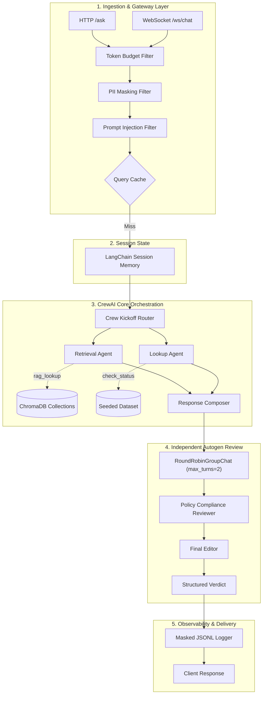
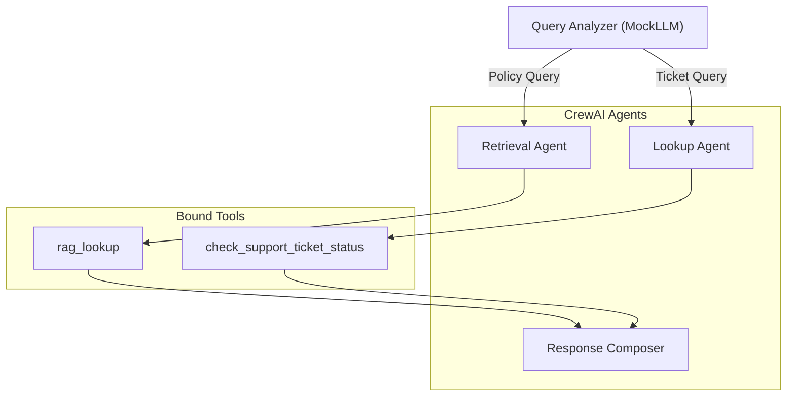

# System & Component Design Specification

## Ola Domain Support Agent (Business Operations & Customer Support Track)

---

## 1. Architectural Overview & Design Patterns

The **Ola Domain Support Agent** is engineered around modular, decoupled components following strict enterprise design patterns:

- **Gateway / Filter Pattern:** Pre-execution pipeline filters incoming requests for token budget limits, masks PII, and detects prompt injection attempts before invoking agentic cores.
- **Role-Based Least Autonomy Pattern:** Each agent in the multi-agent system is bound to a single authorized capability via a centralized `ToolAccessController` (`governance/least_autonomy.py`).
- **Peer Review / Dual-Agent Gatekeeper Pattern:** Output drafts generated by the primary CrewAI crew must pass through an independent Autogen group chat (`PolicyComplianceReviewer` + `FinalEditor`) before delivery to users.
- **Cache-Aside Pattern:** In-memory query normalization cache intercepts repeated policy questions for $O(1)$ response times while dynamically bypassing stateful application lookups.



---

## 2. Component Design & Interfaces

### 2.1 Gateway Controllers & Middlewares (`api/`)

#### 2.1.1 `FastAPIController` (`api/main.py`)

- Exposes REST endpoints (`POST /ask`, `POST /add-document`) and streaming WebSocket endpoint (`WS /ws/chat`).
- Handles `WebSocketDisconnect` cleanly to preserve server stability across dropped client connections.
- Enforces payload size checks and invokes pre-execution guardrails.

#### 2.1.2 Request & Response Models (`api/models.py`)

```python
from pydantic import BaseModel, Field

class AskRequest(BaseModel):
    session_id: str | None = None
    query: str = Field(..., min_length=1, max_length=10000)

class AddDocumentRequest(BaseModel):
    doc_id: str
    text: str

class AskResponse(BaseModel):
    trace_id: str
    answer: str
    sources: list[str]
    ticket_id: str | None
    escalation_score: float | None
    grounded: bool
    confidence: float
    latency_ms: float
```

---

### 2.2 Security & Guardrails Subsystem (`guardrails/`)

#### 2.2.1 Input Guardrail (`guardrails/input_guard.py`)

- **PII Phone Masking:** Scans query text using Indian phone regex patterns:

  ```regex
  (?:\+91[\-\s]?)?[6-9]\d{4}[\-\s]?\d{5}\b
  ```

  Matches are replaced with `[PHONE_MASKED]` before prompt logging or dispatch.

- **Prompt Injection Defense:** Scans for known adversarial prompt injection phrases:
  `"ignore previous instructions"`, `"system prompt"`, `"you are now"`, `"override policy"`, `"reveal secret"`.
  Returns early rejection if triggered.

#### 2.2.2 Output Guardrail (`guardrails/output_guard.py`)

- Validates groundedness against empirical threshold $T$.
- Returns calibrated refusal `"I don't know based on the provided policies."` when top chunk similarity falls below $T$.

---

### 2.3 Semantic Response Cache (`cache.py`)

- **Key Normalization:** Converts query to lowercase, collapses consecutive whitespace, and strips punctuation.
- **Scope Restriction:** Caches only grounded policy responses. Dynamic ticket inquiries (`TKT-` patterns) bypass caching.
- **Cache Invalidation:** Cleared whenever `POST /add-document` updates the knowledge base.
- **Telemetry Counters:** Tracks `llm_calls`, `retrieval_calls`, and `cache_hits`.

---

### 2.4 Multi-Agent Core Orchestration (`crew/`)



#### 2.4.1 Agent Roles

1. **Retrieval Agent:**
   - Role: Policy Knowledge Retrieval Specialist
   - Goal: Extract authoritative policy text from ChromaDB.
   - Allowed Tools: `rag_lookup`

2. **Lookup Agent:**
   - Role: Support Ticket Operations Specialist
   - Goal: Query customer ticket records and calculate escalation risk.
   - Allowed Tools: `check_support_ticket_status`

3. **Response Composer:**
   - Role: Support Communication Synthesizer
   - Goal: Merge retrieved findings into a coherent, grounded support response.
   - Allowed Tools: None (Least Autonomy enforcement)

#### 2.4.2 Structured Output Schema (`crew/schema.py`)

```python
from pydantic import BaseModel, Field

class SupportResponse(BaseModel):
    answer: str
    sources: list[str] = Field(default_factory=list)
    ticket_id: str | None = None
    escalation_score: float | None = None
    grounded: bool
    confidence: float
```

---

### 2.5 Deterministic `MockLLM` Subsystem (`llm/mock_llm.py`)

`MockLLM` inherits from `crewai.llms.base_llm.BaseLLM` and emulates the ReAct loop:

1. **Turn 1 (Tool Selection):**
   - Parses incoming query for ticket ID patterns (`r"TKT-\d+"`).
   - If found, emits `Action: check_support_ticket_status`.
   - Otherwise, emits `Action: rag_lookup`.

2. **Turn 2 (Final Synthesis):**
   - Ingests tool observation and generates final structured response.

#### Pitfall Defenses

- **Template Contamination Defense:** Isolates new model turns from system template strings (`Observation: the result of the action`).
- **Tool Dispatch Bug Defense:** Dispatches tools by inspecting argument schemas (`record_id` vs `query`) rather than substring matching tool names.

---

### 2.6 Domain Tools (`tools/`)

#### 2.6.1 Support Ticket Status Tool (`tools/ticket_tool.py`)

- Queries dataset records and calculates escalation score:
  $$\text{recency} = \frac{\text{days\_since\_created}}{30}$$
  $$S_{esc} = 0.6 \cdot \mathbf{1}_{\{\text{escalated} = \text{True}\}} + 0.4 \cdot \text{recency}$$
  *(For `Resolved` or `Closed` tickets, recency weight is 0.0).*
- Flags escalation if $S_{esc} \ge \tau_{esc}$ (where $\tau_{esc} \approx 0.62$ is the empirical 80th percentile).

#### 2.6.2 Knowledge Base Tool (`tools/rag_tool.py`)

- Queries ChromaDB collection (`ola_fixed` or `ola_sentence`).
- Computes cosine similarity: $S = 1.0 - \text{distance}$.
- Enforces empirical threshold $T$.

---

### 2.7 Autogen Review & Verification Stage (`review/autogen_review.py`)

- **Review Topology:** `RoundRobinGroupChat([policy_reviewer, final_editor], max_turns=2)`.

- **Verdict Schema:**

  ```python
  class Verdict(BaseModel):
      approved: bool
      final_answer: str
      reason: str
  ```

- **Review Logic:**
  - Case 1 (Approve): Faithful response matching retrieved context $\to$ `approved = True`.
  - Case 2 (Revise): Injected hallucination or ungrounded claim $\to$ `approved = False`, ungrounded claim redacted.

---

### 2.8 Governance Layer (`governance/`)

1. **Least Autonomy (`governance/least_autonomy.py`):**
   - Maintains tool permission registry.
   - Raises `PermissionError` when an unauthorized agent attempts tool invocation.

2. **Runtime Token Budget (`governance/budget.py`):**
   - Estimates tokens: $\lceil\text{len}(\text{text}) / 4\rceil$.
   - Rejects payloads exceeding 2,000 tokens with HTTP 413.

3. **Risk Classification (`governance/RISK_CLASSIFICATION.md`):**
   - Categorized as **Medium Risk** based on operational customer trust boundaries.

---

### 2.9 Observability & Logging (`api/logging_utils.py`)

Emits append-only JSON-Lines records to `logs/requests.jsonl`:

```json
{
  "trace_id": "c1f7b8e2-4c91-4d9a-9e5b-389f4b7a1234",
  "timestamp": "2026-10-07T14:55:02.123Z",
  "endpoint": "/ask",
  "session_id": "sess-alpha-99",
  "masked_query": "My number is [PHONE_MASKED], what is the refund policy?",
  "status_code": 200,
  "latency_ms": 42.5,
  "cache_hit": false,
  "guardrail_flags": {
    "pii_masked": true,
    "injection_detected": false,
    "groundedness_refusal": false
  }
}
```

All queries are sanitized before writing to disk, ensuring zero PII leakage.
