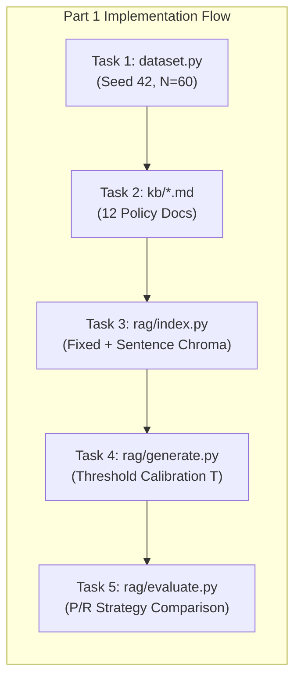
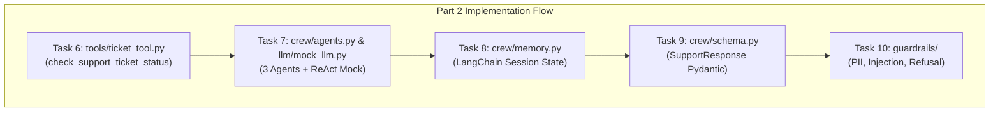
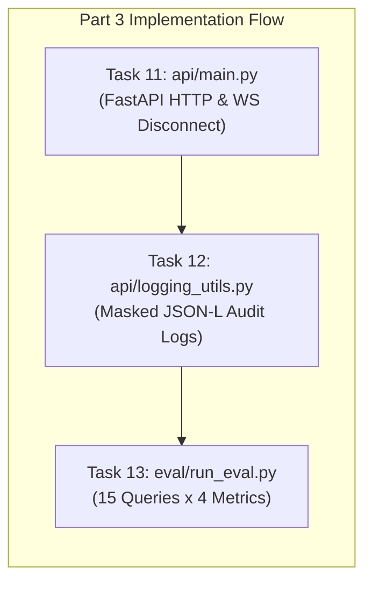
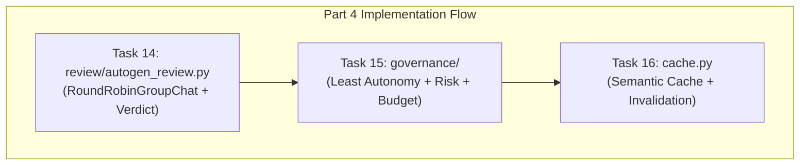

# Implementation Plan: Ola Domain Support Agent

**Project:** Ola Domain Support Agent (`ola-support-agent`)  
**Domain Track:** Business Operations & Customer Support (Ola)  
**Document Version:** 1.0.0  
**Target File Location:** `doc/implement-plan.md`  
**Reference Specifications:**

- System Architecture: [doc/architecture.md](file:///c:/Users/kastu/Desktop/capstone%20-%20service/doc/architecture.md)
- Problem Statement: [doc/problemStatement.md](file:///c:/Users/kastu/Desktop/capstone%20-%20service/doc/problemStatement.md)

---

## 1. Implementation Overview & Guiding Constraints

This document details the step-by-step implementation plan for the **Ola Domain Support Agent**. The implementation is structured into sequential phases covering all 16 tasks across Parts 1 through 4, accompanied by transcript generation, unit testing, and final submission auditing.

### 1.1 Non-Negotiable Operational Constraints

1. **Zero External Network / Zero API Keys:** Execution operates completely under `MOCK_LLM=true` with pre-cached local embeddings (`sentence-transformers/all-MiniLM-L6-v2`) and offline flags (`HF_HUB_OFFLINE=1`, `TRANSFORMERS_OFFLINE=1`).
2. **Telemetry Suppression:** Environment variables `CREWAI_DISABLE_TELEMETRY=true` and `OTEL_SDK_DISABLED=true` must be set prior to running any CrewAI logic.
3. **Documentation Directory Boundary:** All markdown documentation files must reside strictly within the [`doc/`](file:///c:/Users/kastu/Desktop/capstone%20-%20service/doc/) directory (with the sole exception of the required repository-level [`README.md`](file:///c:/Users/kastu/Desktop/capstone%20-%20service/README.md) and [`governance/RISK_CLASSIFICATION.md`](file:///c:/Users/kastu/Desktop/capstone%20-%20service/governance/RISK_CLASSIFICATION.md)).
4. **Media Asset Restriction:** Zero images, PDFs, audio, video, or external slides anywhere in the repository. Architectural diagrams and workflows must use Markdown/Mermaid or text tables.
5. **Deterministic Verifiability:** Every task must output its verification evidence to an individual transcript in [`transcripts/`](file:///c:/Users/kastu/Desktop/capstone%20-%20service/transcripts/).

---

## 2. Phase-by-Phase Execution Roadmap

```text
+---------------------------------------------------------------------------------------+
|                                IMPLEMENTATION PHASES                                  |
+-----------+-----------------------------------+-------------------+-------------------+
| Phase     | Scope                             | Key Deliverables  | Target Tasks      |
+-----------+-----------------------------------+-------------------+-------------------+
| Phase 0   | Scaffolding, Env, Dependencies    | requirements.txt  | Prep & Setup      |
| Phase 1   | Dataset & RAG Core Subsystem      | dataset.py, rag/  | Tasks 1 - 5       |
| Phase 2   | Multi-Agent Crew, Tools & Guards  | crew/, guardrails | Tasks 6 - 10      |
| Phase 3   | FastAPI, Audit Logging & Eval     | api/, eval/       | Tasks 11 - 13     |
| Phase 4   | Autogen Review & Governance       | review/, gov/, $$ | Tasks 14 - 16     |
| Phase 5   | Automated Transcripts & Testing   | scripts/, tests/  | Verification      |
| Phase 6   | README & Submission Audit         | README.md, Audit  | Final Release     |
+-----------+-----------------------------------+-------------------+-------------------+
```

---

## Phase 0: Scaffolding, Environment & Dependency Pinning

### 0.1 Directory Hierarchy Creation

Create the production directory skeleton matching the architecture specification:

```text
ola-support-agent/
├── doc/
├── kb/
├── rag/
├── llm/
├── tools/
├── crew/
├── guardrails/
├── review/
├── governance/
├── api/
├── eval/
├── scripts/
├── transcripts/
└── tests/
```

### 0.2 Environment Configuration (`.env.example` & `.env`)

- Define required environment variables:

  ```ini
  MOCK_LLM=true
  CREWAI_DISABLE_TELEMETRY=true
  OTEL_SDK_DISABLED=true
  HF_HUB_OFFLINE=1
  TRANSFORMERS_OFFLINE=1
  LOG_LEVEL=INFO
  ```

### 0.3 Pinned Dependencies (`requirements.txt`)

Pin compatible library versions ensuring no packaging conflicts between CrewAI, LangChain, Autogen, and ChromaDB:

- `fastapi>=0.110.0,<0.116.0`
- `uvicorn[standard]>=0.28.0`
- `pydantic>=2.6.0,<3.0.0`
- `crewai>=0.28.0,<0.80.0`
- `autogen-agentchat>=0.2.0,<0.5.0`
- `chromadb>=0.4.22,<0.6.0`
- `sentence-transformers>=2.5.0,<3.2.0`
- `langchain-core>=0.1.30,<0.4.0`
- `pytest>=8.0.0`
- `pytest-asyncio>=0.23.0`
- `starlette>=0.37.0`
- `python-dotenv>=1.0.0`

---

## Phase 1: Part 1 — Dataset Design & RAG Core (30 Marks)



### Task 1: Synthetic Dataset Generator (`dataset.py`)

- **Objective:** Generate $N = 60$ realistic Ola customer support records.
- **Fields:**
  - `record_id`: String `"TKT-0001"` through `"TKT-0060"`.
  - `category`: Categorical (`Billing` 0.25, `Technical Issue` 0.25, `Account Access` 0.20, `Product Defect` 0.15, `General Inquiry` 0.15).
  - `status`: Categorical (`Open` 0.20, `In Progress` 0.20, `Escalated` 0.15, `Resolved` 0.25, `Closed` 0.20).
  - `resolution_time_hours`: Skewed log-normal distribution clipped to $[0.5, 72.0]$.
  - `days_since_created`: Integer in $[0, 30]$.
  - `escalated`: Boolean Bernoulli flag conditioned on status (0.85 if `Escalated`, 0.08 otherwise), hitting $18\% - 22\%$ (within the required $10\% - 30\%$ band).
- **Validation Routine (`if __name__ == "__main__":`):**
  - Verify category counts: all $\ge 3$.
  - Verify status counts: all $\ge 1$.
  - Verify escalation percentage: $10\% \le \text{rate} \le 30\%$.
  - Run twice to assert byte-identical determinism under seed 42.
- **Deliverable Transcript:** Output directed to `transcripts/task01_dataset.txt`.

### Task 2: Knowledge Base Authoring (`kb/`)

- **Objective:** Author 12 distinct Markdown policy files (2–5 sentences each) with quantitative numbers, SLA hours, and specific terminology:
  1. [`kb/ticket_priority_rules.md`](file:///c:/Users/kastu/Desktop/capstone%20-%20service/kb/ticket_priority_rules.md) — P1 (safety emergency) to P4 (general request) definitions.
  2. [`kb/sla_by_severity.md`](file:///c:/Users/kastu/Desktop/capstone%20-%20service/kb/sla_by_severity.md) — Sev-1 (1h response, 4h fix), Sev-2 (4h/12h), Sev-3 (12h/48h), Sev-4 (24h/72h).
  3. [`kb/escalation_matrix.md`](file:///c:/Users/kastu/Desktop/capstone%20-%20service/kb/escalation_matrix.md) — Tier-1 Support $\to$ Team Lead $\to$ Operations Head.
  4. [`kb/refund_compensation_policy.md`](file:///c:/Users/kastu/Desktop/capstone%20-%20service/kb/refund_compensation_policy.md) — Driver cancellation fee waiver, 5–7 business days gateway refund.
  5. [`kb/communication_channels.md`](file:///c:/Users/kastu/Desktop/capstone%20-%20service/kb/communication_channels.md) — In-app chat, SOS emergency button (<30s response), registered email.
  6. [`kb/business_hours_support.md`](file:///c:/Users/kastu/Desktop/capstone%20-%20service/kb/business_hours_support.md) — 24/7 passenger emergency desk vs 09:00–18:00 partner support hubs.
  7. [`kb/repeat_complaint_handling.md`](file:///c:/Users/kastu/Desktop/capstone%20-%20service/kb/repeat_complaint_handling.md) — 3+ incidents within 14 days escalates to supervisor queue within 2h.
  8. [`kb/service_credit_policy.md`](file:///c:/Users/kastu/Desktop/capstone%20-%20service/kb/service_credit_policy.md) — Ola Money ride credit issued within 24h for route deviations.
  9. [`kb/feedback_collection.md`](file:///c:/Users/kastu/Desktop/capstone%20-%20service/kb/feedback_collection.md) — 60-second post-trip star rating, CSAT surveys.
  10. [`kb/vip_customer_policy.md`](file:///c:/Users/kastu/Desktop/capstone%20-%20service/kb/vip_customer_policy.md) — Ola Select and Prime Plus expedited queues (<15 min first response).
  11. [`kb/outage_communication.md`](file:///c:/Users/kastu/Desktop/capstone%20-%20service/kb/outage_communication.md) — In-app broadcast and SMS alerts within 15 mins of Sev-1 outages.
  12. [`kb/data_retention_policy.md`](file:///c:/Users/kastu/Desktop/capstone%20-%20service/kb/data_retention_policy.md) — 180 days active storage, 3 years encrypted cold archival.

### Task 3: Dual Chunking Strategies & Chroma Vector Indexing (`rag/`)

- **Implement Chunkers (`rag/chunking.py`):**
  - `fixed_chunking(text, chunk_size=200, overlap=40)`: Sliding character window.
  - `sentence_chunking(text)`: Regex punctuation splitter (`r'(?<=[.!?])\s+'`), preserving full sentences without external NLTK dependencies.
- **Implement Indexing (`rag/index.py`):**
  - Initialize local `SentenceTransformer("all-MiniLM-L6-v2")`.
  - Create two isolated Chroma collections: `ola_fixed` and `ola_sentence` configured with `{"hnsw:space": "cosine"}`.
  - Upsert chunks with metadata: `doc_id`, `chunk_index`, `strategy`.
- **Deliverable Transcript:** Sample retrieval from both collections written to `transcripts/task03_chunking.txt`.

### Task 4: Grounded Generation & Empirical Threshold Calibration (`rag/generate.py`)

- **Cosine Metric Alignment:**
  $$\text{Cosine Similarity } S = 1.0 - \text{distance}$$
- **Threshold Calibration Protocol:**
  - In-Scope Test Queries ($Q_{in} \ge 3$): SLA timelines, repeat complaints, refund criteria.
  - Out-of-Scope Test Queries ($Q_{out} \ge 2$): International airline bookings, movie reviews.
  - Record similarity distributions: $S_{in} = \min(S(Q_{in}))$, $S_{out} = \max(S(Q_{out}))$.
  - Calculate empirical threshold: $T = \frac{S_{in} + S_{out}}{2}$.
- **Grounded Generation Logic:**
  - If top-1 similarity $< T$: Return fallback `"I don't know based on the provided policies."` with `grounded = False`.
  - If top-1 similarity $\ge T$: Extractively compose answer from top-$k$ ($k=3$) chunks.
- **Deliverable Transcript:** Calibration cluster printout, threshold justification, 5 in-scope query responses, and 1 out-of-scope fallback response written to `transcripts/task04_threshold.txt`.

### Task 5: Chunking Strategy Evaluation & Recommendation (`rag/evaluate.py`)

- **Evaluation Benchmark:** 5 policy queries evaluated across both `ola_fixed` and `ola_sentence`.
- **Deduplicated Parent Document Evaluation:**
  - Map retrieved chunks to parent doc IDs; deduplicate: $D_{retrieved}$.
  - Compute Precision: $\frac{|D_{retrieved} \cap D_{relevant}|}{|D_{retrieved}|}$.
  - Compute Recall: $\frac{|D_{retrieved} \cap D_{relevant}|}{|D_{relevant}|}$.
- **Comparison Table & Recommendation:**
  - Print full arithmetic table for each query.
  - Provide a 3-sentence recommendation citing empirical precision and recall numbers.
- **Deliverable Transcript:** Written to `transcripts/task05_chunking_comparison.txt`.

---

## Phase 2: Part 2 — CrewAI Orchestration, Tools, Memory & Guardrails (30 Marks)



### Task 6: Ticket Status Tool & Escalation Formula (`tools/ticket_tool.py`)

- **Implement `check_support_ticket_status(record_id: str) -> dict`:**
  - Lookup record in `dataset.SUPPORT_TICKETS`.
  - Return error dict if `record_id` not found: `{"error": f"Ticket {record_id} not found", "status": "Unknown"}`.
- **Implement Escalation Formula:**
  $$\text{recency} = \frac{\text{days\_since\_created}}{30}$$
  $$S_{esc} = 0.6 \cdot \mathbf{1}_{\{\text{escalated} = \text{True}\}} + 0.4 \cdot \text{recency}$$
  *(Refinement: If `status` is `"Resolved"` or `"Closed"`, recency weight is set to 0.0).*
- **Empirical Threshold Justification:**
  - Compute 80th percentile of $S_{esc}$ across the $N=60$ dataset records ($\tau_{esc} \approx 0.62$).
  - If $S_{esc} \ge \tau_{esc}$, flag as high escalation risk.
- **Deliverable Transcript:** Formula distribution, threshold justification, and status lookups written to `transcripts/task06_ticket_tool.txt`.

### Task 7: CrewAI 3-Agent Topology & Deterministic `MockLLM` (`crew/`, `llm/`)

- **Build `llm/mock_llm.py` extending `crewai.llms.base_llm.BaseLLM`:**
  - Emulate ReAct loop deterministically:
    - Call 1: Detect intent $\to$ emit `Thought / Action / Action Input`.
    - Call 2: Ingest tool observation $\to$ emit `Thought: I now know the final answer / Final Answer: ...`.
  - **Resolve Pitfall 1 (Template Contamination):** Isolate newly generated messages. Do not search full prompt for `"Observation:"`.
  - **Resolve Pitfall 2 (Tool Name Substring Collision):** Dispatch based on tool argument signature (`record_id` vs `query`).
- **Unit Test Suite (`tests/test_mock_llm.py`):**
  - Verify placeholder `"Observation: the result of the action"` never leaks into output.
  - Verify tool dispatch accurately routes `rag_lookup` vs `check_support_ticket_status`.
- **Assemble Crew (`crew/agents.py`, `crew/crew.py`):**
  - Agent 1: `Retrieval Agent` (Tool: `rag_lookup`).
  - Agent 2: `Lookup Agent` (Tool: `check_support_ticket_status`).
  - Agent 3: `Response Composer` (No tools).
- **Execution & Deliverable Transcript:** Kickoff crew on 1 policy query and 1 ticket query showing tool logs; written to `transcripts/task07_crew_kickoff.txt`.

### Task 8: Conversational Session Memory (`crew/memory.py`)

- **Implement LangChain Memory:**
  - Use `InMemoryChatMessageHistory` with `RunnableWithMessageHistory` keyed by `session_id`.
- **Pronoun & Entity Resolution:**
  - Extract referenced ticket ID (e.g., `TKT-0007`) into session state.
  - Query preprocessor resolves ambiguous pronouns ("that one", "the ticket") by injecting previously referenced ticket IDs.
- **Transcripts:**
  - `transcripts/task08_memory_session_a.txt`: Multi-turn session: Turn 1 ("Check TKT-0007") $\to$ Turn 2 ("Is that one at risk of escalation?").
  - `transcripts/task08_memory_session_b.txt`: Fresh session with same follow-up ("Is that one at risk?") showing state absence and prompt for ticket ID.

### Task 9: Structured Pydantic Output (`crew/schema.py`)

- **Define `SupportResponse(BaseModel)`:**

  ```python
  class SupportResponse(BaseModel):
      answer: str
      sources: list[str]
      ticket_id: str | None
      escalation_score: float | None
      grounded: bool
      confidence: float
  ```

- **Validation Pipeline:**
  - Enforce `response_format=SupportResponse` on CrewAI composer output.
  - Validate in code via `SupportResponse.model_validate()`.
- **Deliverable Transcript:** Validated output json written to `transcripts/task09_structured_output.txt`.

### Task 10: Input/Output Guardrails (`guardrails/`)

- **Input Guardrails (`guardrails/input_guard.py`):**
  - Indian phone regex: `(?:\+91[\-\s]?)?[6-9]\d{4}[\-\s]?\d{5}\b` replaced with `[PHONE_MASKED]`.
  - Prompt injection detection: Check keywords (`"ignore previous instructions"`, `"system prompt"`, `"you are now"`, `"override"`). Block and return refusal.
- **Output Guardrail (`guardrails/output_guard.py`):**
  - Groundedness verification using calibrated threshold $T$; refuse ungrounded responses.
- **Deliverable Transcript:** Demos of phone masking, injection block, and groundedness refusal written to `transcripts/task10_guardrails.txt`.

---

## Phase 3: Part 3 — FastAPI, Observability & Evaluation (20 Marks)



### Task 11: FastAPI Endpoints & WebSocket Resilience (`api/`)

- **Implement Endpoints (`api/main.py`):**
  - `POST /ask`: Request `{session_id, query}` $\to$ Response `{trace_id, data: SupportResponse, latency_ms}`.
  - `POST /add-document`: Request `{doc_id, text}` $\to$ chunk, embed, upsert to Chroma, invalidate cache.
  - `WS /ws/chat`: Multi-turn chat WebSocket.
- **WebSocket Disconnect Resilience:**
  - Wrap receive loop in `try...except WebSocketDisconnect`.
  - Test via `starlette.testclient.TestClient`: Connect, send message, disconnect abruptly, reconnect second socket, confirm system remains operational.
- **Deliverable Transcript:** HTTP requests and WebSocket disconnect lifecycle written to `transcripts/task11_websocket.txt`.

### Task 12: Structured JSON-Lines Audit Logging (`api/logging_utils.py`)

- **Logging Specifications:**
  - Append to `logs/requests.jsonl`.
  - Required fields: `trace_id` (uuid4), `timestamp`, `endpoint`, `session_id`, `masked_query`, `status_code`, `latency_ms`, `cache_hit`, `guardrail_flags`.
- **Pre-Log Sanitization Test (`tests/test_logging.py`):**
  - Query containing phone number `+91 98765 43210` is logged.
  - Automated test greps `logs/requests.jsonl` asserting zero occurrences of the raw number.
- **Deliverable Transcript:** Log entries and grep assertion test output written to `transcripts/task12_logging.txt`.

### Task 13: 15-Query Evaluation Suite & LLM-as-Judge (`eval/`)

- **Query Dataset (`eval/test_queries.py`):**
  - 12 queries covering all 12 KB policy documents.
  - 1 ticket lookup query (`TKT-0007`).
  - 2 adversarial/edge-case queries (prompt injection and out-of-scope question).
- **Deterministic Mock Judge (`eval/judge.py`):**
  - Evaluates 4 metrics (1–5 scale): Accuracy, Grounding, Completeness, Safety.
  - Deterministic lexical overlap and heuristic scoring rules.
- **Evaluation Runner (`eval/run_eval.py`):**
  - Execute all 15 queries through the pipeline.
  - Format 15-row table with individual scores and summary averages.
- **Deliverable Transcript:** Evaluation table and summary statistics written to `transcripts/task13_eval.txt`.

---

## Phase 4: Part 4 — Autogen Review & Governance (20 Marks)



### Task 14: Autogen Multi-Agent Review Team (`review/autogen_review.py`)

- **Review Architecture:**
  - Agents: `PolicyComplianceReviewer` and `FinalEditor`.
  - Chat: `RoundRobinGroupChat(agents=[...], max_turns=2, custom_message_types=[StructuredMessage[Verdict]])`.
  - Output Content Type: `StructuredMessage[Verdict]` where `Verdict` defines `{approved: bool, final_answer: str, reason: str}`.
- **Autonomous Mock Client:**
  - Keyless mock `ChatCompletionClient` analyzing draft sentences against retrieved source context.
- **Verification Demos:**
  - Demo 1 (Approve): Faithful response $\to$ `approved = True`, `final_answer == draft`.
  - Demo 2 (Revise): Injected hallucination ("Ola provides a ₹500 compensation voucher for all delays") $\to$ `approved = False`, ungrounded claim redacted.
- **Deliverable Transcript:** Transcripts of both review demos written to `transcripts/task14_autogen_review.txt`.

### Task 15: Four-Layer Governance (`governance/`)

- **Application Layer — Least Autonomy (`governance/least_autonomy.py`):**
  - Tool binding registry: `{"rag_lookup": ["Retrieval Agent"], "check_support_ticket_status": ["Lookup Agent"]}`.
  - `assign_tool(agent_role, tool_name)` raises `PermissionError` if unauthorized.
  - Demo: Attempting to assign `check_support_ticket_status` to `Response Composer` raises `PermissionError`.
- **Risk Governance Document (`governance/RISK_CLASSIFICATION.md`):**
  - Document system risk tier as **Medium Risk** with justification covering customer expectations, operational trust, and lack of automated financial write access.
- **Runtime Layer — Token Budget Cap (`governance/budget.py`):**
  - Heuristic token estimation: $\text{tokens} = \lceil\text{len}(\text{text}) / 4\rceil$.
  - Reject payloads $> 2,000$ estimated tokens with HTTP 413/422.
  - Demo: Side-by-side comparison of accepted normal query and rejected 20 KB query.
- **Deliverable Transcript:** Written to `transcripts/task15_least_autonomy.txt`.

### Task 16: Response Caching Subsystem (`cache.py`)

- **Cache Specifications:**
  - Key normalization: Lowercase, collapse whitespace, strip punctuation.
  - Scope: Caches only grounded policy queries (ignores dynamic ticket queries).
  - Telemetry counters: `llm_calls`, `retrieval_calls`, `cache_hits`.
  - Invalidation: Cache cleared automatically when `POST /add-document` is invoked.
- **Verification Demo:**
  - Query 1 (Cold): `cache_hit = False`, `retrieval_calls = 1`, `llm_calls = 1`.
  - Query 1 Repeat (Warm): `cache_hit = True`, `retrieval_calls = 1`, `llm_calls = 1`, latency $< 1$ ms.
- **Deliverable Transcript:** Before/after counters and latency metrics written to `transcripts/task16_cache.txt`.

---

## Phase 5: Automated Verification & Transcript Pipeline

### 5.1 Automated Script Runners (`scripts/`)

Create standalone runner scripts to reproduce every task transcript deterministically:

- `python -m scripts.run_task01` $\to$ `transcripts/task01_dataset.txt`
- `python -m scripts.run_task03` $\to$ `transcripts/task03_chunking.txt`
- `python -m scripts.run_task04` $\to$ `transcripts/task04_threshold.txt`
- `python -m scripts.run_task05` $\to$ `transcripts/task05_chunking_comparison.txt`
- `python -m scripts.run_task06` $\to$ `transcripts/task06_ticket_tool.txt`
- `python -m scripts.run_task07` $\to$ `transcripts/task07_crew_kickoff.txt`
- `python -m scripts.run_task08` $\to$ `transcripts/task08_memory_session_a.txt` & `task08_memory_session_b.txt`
- `python -m scripts.run_task09` $\to$ `transcripts/task09_structured_output.txt`
- `python -m scripts.run_task10` $\to$ `transcripts/task10_guardrails.txt`
- `python -m scripts.run_task11` $\to$ `transcripts/task11_websocket.txt`
- `python -m scripts.run_task12` $\to$ `transcripts/task12_logging.txt`
- `python -m scripts.run_task13` $\to$ `transcripts/task13_eval.txt`
- `python -m scripts.run_task14` $\to$ `transcripts/task14_autogen_review.txt`
- `python -m scripts.run_task15` $\to$ `transcripts/task15_least_autonomy.txt`
- `python -m scripts.run_task16` $\to$ `transcripts/task16_cache.txt`
- Top-level master runner: `python scripts/run_all.py` (or `bash scripts/run_all.sh`).

### 5.2 Unit Test Suite (`tests/`)

- `tests/test_dataset.py`: Assert record count $N=60$, category counts $\ge 3$, escalation band $10\%-30\%$, reproducibility.
- `tests/test_mock_llm.py`: Assert no template contamination and correct tool dispatch by argument signature.
- `tests/test_guardrails.py`: Assert phone masking and prompt injection detection.
- `tests/test_logging.py`: Assert zero raw telephone number leakage in `logs/requests.jsonl`.
- `tests/test_api.py`: Assert FastAPI endpoint contracts and WebSocket disconnect handling.

---

## Phase 6: README Authoring & Final Submission Audit

### 6.1 `README.md` Authoring Structure

The root [`README.md`](file:///c:/Users/kastu/Desktop/capstone%20-%20service/README.md) must follow the required outline:

1. **Track Statement:** Ola (Business Operations / Customer Support).
2. **Dataset Design Choices:** Seed `42`, 60 records, category weights, status weights, resolution-time range (0.5–72h), reasoning sentence.
3. **Setup & Execution:** Instructions for running with `MOCK_LLM=true`, confirmation of `CREWAI_DISABLE_TELEMETRY=true` and `OTEL_SDK_DISABLED=true`, offline embedding model caching steps.
4. **Part 1 Results:** Cosine threshold calibration table, precision/recall arithmetic tables, chunking recommendation.
5. **Part 2 Results:** Escalation formula, threshold justification, crew kickoff logs, memory transcripts, guardrail outputs.
6. **Part 3 Results:** API usage, log sample, 15-query evaluation benchmark table with summary averages.
7. **Part 4 Results:** Autogen review verdicts (approve vs revise), governance enforcement (least autonomy, risk classification, token budget), caching telemetry.
8. **Known Limitations:** Name/address/payment not masked by design; in-memory session and cache storage.
9. **Transcript Index:** Mapping each task to its transcript file in `transcripts/`.

### 6.2 Pre-Submission Acceptance Checklist

- [ ] `dataset.py` produces $N=60$ records with category counts $\ge 3$, all statuses, escalation rate between $10\%-30\%$.
- [ ] 12 Markdown knowledge base documents exist in `kb/` with quantitative SLAs and distinct vocabulary.
- [ ] Dual chunking strategies (fixed 200/40 and sentence-based) indexed into ChromaDB collections `ola_fixed` and `ola_sentence`.
- [ ] Empirical cosine threshold $T$ calculated and justified in README; fallback response verified.
- [ ] Precision/recall arithmetic calculated for both chunking strategies with numbers-cited recommendation.
- [ ] `check_support_ticket_status` implements escalation formula and justifies 80th percentile threshold $\tau_{esc}$.
- [ ] CrewAI 3-agent crew runs under `MockLLM` with regression tests for template contamination and tool dispatch.
- [ ] Multi-turn session memory transcript resolves pronouns; fresh session transcript shows isolation.
- [ ] `SupportResponse` Pydantic model validated on every response.
- [ ] Phone masking (`[PHONE_MASKED]`), injection blocking, and groundedness refusal demonstrated.
- [ ] FastAPI `/ask`, `/add-document`, and WebSocket surviving mid-conversation disconnect demonstrated.
- [ ] JSON-Lines logging emits `trace_id` and is verified to contain zero raw phone numbers.
- [ ] 15-query evaluation scored across 4 metrics by deterministic mock judge.
- [ ] Autogen review demonstrates both approval and ungrounded claim revision with `Verdict`.
- [ ] Least autonomy raises `PermissionError`; risk classified as Medium; requests $> 2,000$ tokens rejected.
- [ ] Cache hit verified with call counter evidence; invalidation on `/add-document` verified.
- [ ] Zero media files (no images, PDFs, slides, video, audio) in the repository.
- [ ] Zero external network calls required (runs under `MOCK_LLM` and offline embeddings).
- [ ] All `.md` documentation files (except root `README.md` and `governance/RISK_CLASSIFICATION.md`) reside strictly in `doc/`.

---

## 3. 14-Day Implementation Schedule & Milestones

| Day | Primary Milestone | Code Components | Target Transcripts |
| :--- | :--- | :--- | :--- |
| **Day 1** | Scaffold, env, dataset generator & validation | `dataset.py`, `.env.example`, `requirements.txt` | `task01_dataset.txt` |
| **Day 2** | 12 KB docs, fixed & sentence chunking | `kb/*.md`, `rag/chunking.py` | — |
| **Day 3** | Chroma indexing, embeddings, threshold calibration | `rag/index.py`, `rag/generate.py` | `task03_chunking.txt`, `task04_threshold.txt` |
| **Day 4** | Retrieval evaluation (P/R arithmetic), Part 1 README | `rag/evaluate.py` | `task05_chunking_comparison.txt` |
| **Day 5** | Ticket tool, escalation formula, start `MockLLM` | `tools/ticket_tool.py`, `llm/mock_llm.py` | `task06_ticket_tool.txt` |
| **Day 6** | `MockLLM` pitfall tests, 3-agent crew assembly | `crew/agents.py`, `crew/crew.py`, `tests/` | `task07_crew_kickoff.txt` |
| **Day 7** | Session memory (multi-turn), Pydantic schemas | `crew/memory.py`, `crew/schema.py` | `task08_memory_session_a/b.txt`, `task09_structured_output.txt` |
| **Day 8** | Guardrails (PII masking, injection, groundedness) | `guardrails/input_guard.py`, `output_guard.py` | `task10_guardrails.txt` |
| **Day 9** | FastAPI HTTP endpoints, disconnect-resilient WS | `api/main.py`, `api/models.py` | `task11_websocket.txt` |
| **Day 10** | Masked JSON-L logging, 15-query evaluation suite | `api/logging_utils.py`, `eval/` | `task12_logging.txt`, `task13_eval.txt` |
| **Day 11** | Autogen review stage (approve & revise cases) | `review/autogen_review.py` | `task14_autogen_review.txt` |
| **Day 12** | Governance (least autonomy, risk doc, budget, cache) | `governance/`, `cache.py` | `task15_least_autonomy.txt`, `task16_cache.txt` |
| **Day 13** | Master transcript runner, full regression testing | `scripts/run_all.py`, `tests/` | All transcripts verified |
| **Day 14** | README completion, acceptance audit, clean clone check | `README.md`, final audit | Submission ready |
