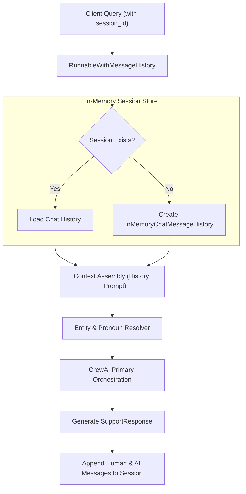
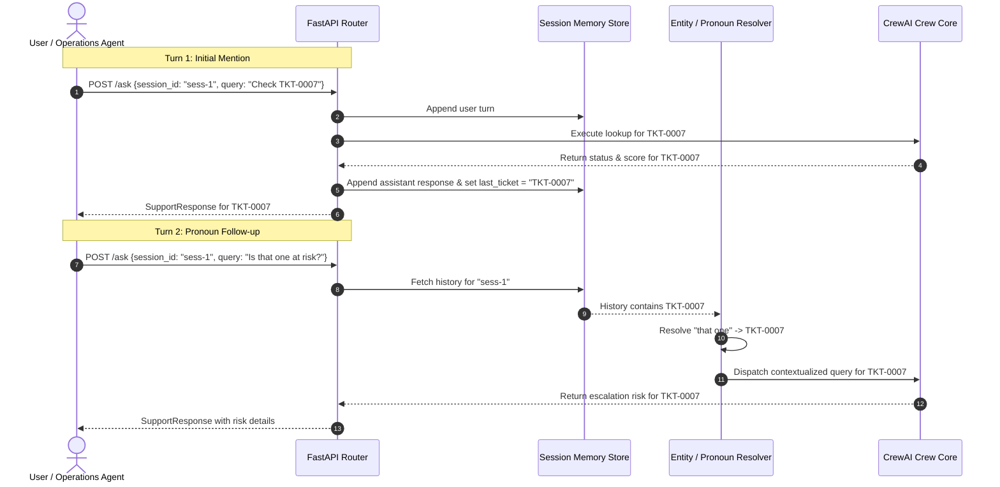

# Conversational Memory & Session State Specification

## Ola Domain Support Agent (Business Operations & Customer Support Track)

---

## 1. Memory Architecture & Technical Stack

The **Ola Domain Support Agent** implements conversational session memory to maintain context across multi-turn interactions. This allows riders, drivers, and internal support staff to ask follow-up questions, resolve ticket references and pronouns, and maintain conversational continuity without re-specifying ticket IDs or previous contexts.

### Technical Components

- **Framework:** LangChain Core memory abstraction.
- **Backing Store:** `InMemoryChatMessageHistory` (ephemeral dictionary partitioned by `session_id`).
- **Execution Wrapper:** `RunnableWithMessageHistory`.
- **Partition Key:** Unique `session_id` (UUIDv4 string passed in request payload or WebSocket handshake).



---

## 2. Session Lifecycle & State Isolation

### 2.1 Session Initialization & Retrieval

- Each request to `/ask` or connection frame to `/ws/chat` accepts an optional `session_id`.
- If omitted, the gateway generates a fresh UUIDv4 identifier:

  ```python
  session_id = request.session_id or str(uuid.uuid4())
  ```

- The memory manager indexes histories in a thread-safe store:

  ```python
  from langchain_core.chat_history import InMemoryChatMessageHistory

  session_store: dict[str, InMemoryChatMessageHistory] = {}

  def get_session_history(session_id: str) -> InMemoryChatMessageHistory:
      if session_id not in session_store:
          session_store[session_id] = InMemoryChatMessageHistory()
      return session_store[session_id]
  ```

---

## 3. Pronoun & Entity Resolution Mechanism

In operational support conversations, users frequently refer back to previously discussed tickets using pronouns or demonstratives (e.g., "that one", "the ticket", "is it escalated?").

### Resolution Workflow

1. **Turn 1 (Ticket Mention):**
   - User submits: `"Check status of TKT-0007."`
   - Memory records user message and assistant reply.
   - Entity tracker extracts `current_ticket_id = "TKT-0007"` into session metadata.
2. **Turn 2 (Pronoun Follow-Up):**
   - User submits: `"Is that one at risk of escalation?"`
   - Pre-execution resolver scans the active session history for the most recent ticket ID pattern (`TKT-\d+`).
   - If found, the query is contextualized as: `"Is ticket TKT-0007 at risk of escalation?"` before crew dispatch.
   - The crew's Lookup Agent then executes `check_support_ticket_status("TKT-0007")`.



---

## 4. State Isolation & Edge Cases

### 4.1 Cross-Session Isolation (Transcript A vs Transcript B)

- **Transcript A (Same Session ID):**
  - Turn 1: `"Check TKT-0007"`
  - Turn 2: `"Is that one at risk of escalation?"`
  - *Result:* Successfully resolves `"that one"` to `TKT-0007` and evaluates escalation score.
- **Transcript B (Fresh Session ID):**
  - User submits Turn 2 query (`"Is that one at risk of escalation?"`) with a new, uninitialized `session_id`.
  - *Result:* No prior context exists in session history. The resolver detects missing entity context and prompts the user:
    `"Please specify the ticket ID (e.g., TKT-0001) you would like to check."`

### 4.2 In-Memory Lifecycle & Concurrency

- **Thread Safety:** Memory accesses in ASGI asynchronous loops operate under Python's event loop cooperative multitasking.
- **WebSocket Disconnect Cleanup:** When a WebSocket connection drops (`WebSocketDisconnect`), session state remains accessible for subsequent reconnects under the same `session_id` within standard process memory.
- **Cache Isolation:** Response caching operates strictly for stateless policy queries; queries with session-specific pronoun resolutions bypass cache storage to prevent context bleeding.

---

## 5. Verification & Deliverables

The session memory behavior is validated through two automated transcripts:

1. `transcripts/task08_memory_session_a.txt`: Validates continuous multi-turn pronoun resolution within a single session.
2. `transcripts/task08_memory_session_b.txt`: Validates clean session isolation and graceful prompt for ticket ID when context is absent.
